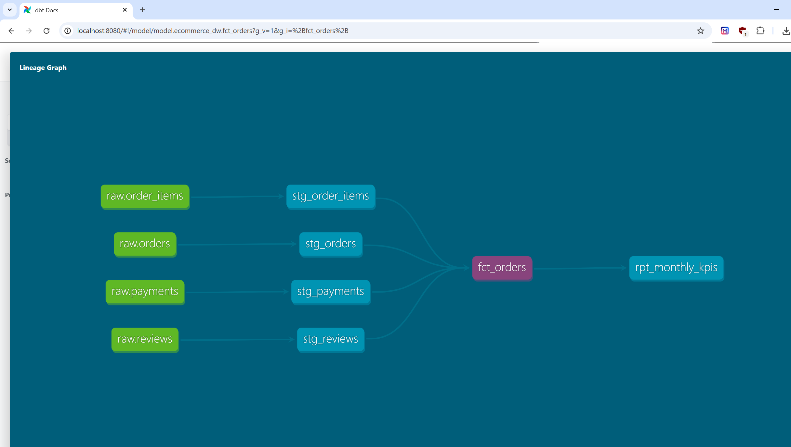
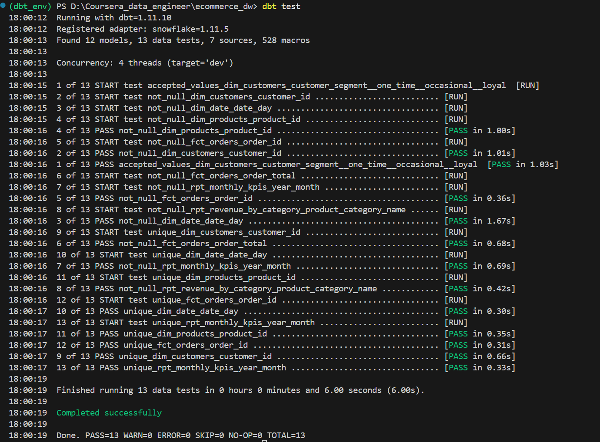
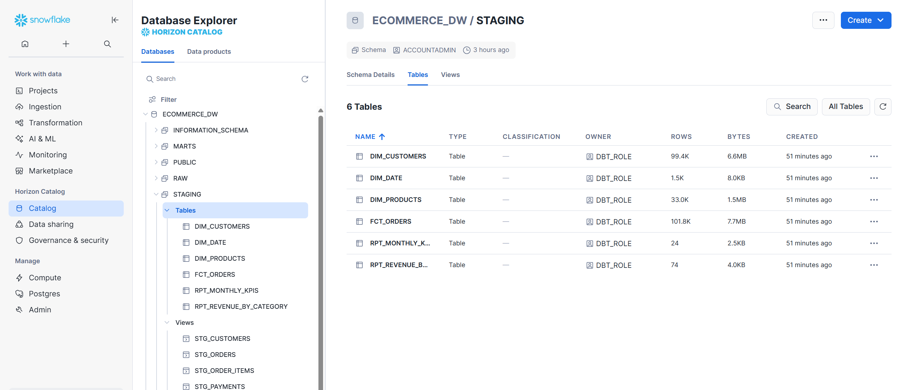
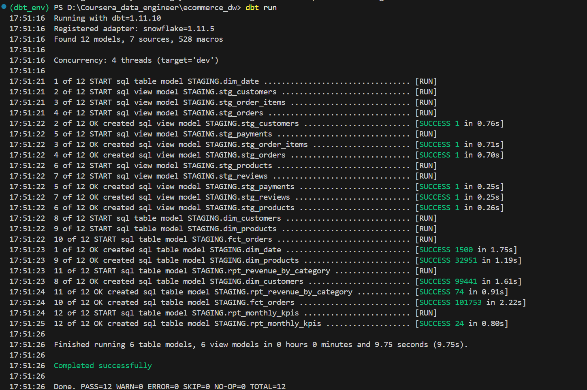

# E-commerce Analytics Data Warehouse

> End-to-end Data Warehouse built with **dbt** and **Snowflake**, modeling
> 100K+ Brazilian e-commerce transactions into clean, tested, and documented
> analytical layers — from raw CSV ingestion to production-ready KPI reporting.

---

## Table of Contents

- [Overview](#overview)
- [Architecture](#architecture)
- [Tech Stack](#tech-stack)
- [Project Structure](#project-structure)
- [Data Model](#data-model)
- [Key Business Metrics](#key-business-metrics)
- [Screenshots](#screenshots)
- [How to Run](#how-to-run)
- [Data Quality Tests](#data-quality-tests)
- [Dataset](#dataset)
- [What I Learned](#what-i-learned)
- [Author](#author)
- [License](#license)

---

## Overview

This project implements a modern **ELT pipeline** for e-commerce analytics using the
[Olist Brazilian E-Commerce dataset](https://www.kaggle.com/datasets/olistbr/brazilian-ecommerce)
(~100K orders, 9 CSV files).

The pipeline transforms raw transactional data into a dimensional Data Warehouse
with automated **data quality tests**, **auto-generated documentation**, and
**business KPIs** ready for dashboard consumption.

---

## Architecture

```
┌─────────────────────────────────────────────────────────────────┐
│                          DATA FLOW                              │
│                                                                 │
│  CSV Files (Kaggle)                                             │
│       │                                                         │
│       ▼                                                         │
│  ┌─────────────┐                                                │
│  │  Snowflake  │  RAW Schema — 7 tables, ~500K rows             │
│  │  RAW Layer  │  (orders, items, customers, products,          │
│  └──────┬──────┘   payments, reviews, sellers)                  │
│         │                                                       │
│         ▼  dbt run                                              │
│  ┌─────────────┐                                                │
│  │   STAGING   │  6 views — cleaned, typed, renamed             │
│  │    Layer    │  (stg_orders, stg_customers, ...)              │
│  └──────┬──────┘                                                │
│         │                                                       │
│         ▼  dbt run                                              │
│  ┌─────────────┐                                                │
│  │    MARTS    │  Dimensional model                             │
│  │    Layer    │  dim_customers · dim_products · dim_date       │
│  │             │  fct_orders (101K rows)                        │
│  └──────┬──────┘                                                │
│         │                                                       │
│         ▼  dbt run                                              │
│  ┌─────────────┐                                                │
│  │  REPORTING  │  Business KPIs                                 │
│  │    Layer    │  rpt_monthly_kpis · rpt_revenue_by_category    │
│  └─────────────┘                                                │
└─────────────────────────────────────────────────────────────────┘
```

---

## Tech Stack

| Tool | Version | Purpose |
|------|---------|---------|
| **Snowflake** | Standard Edition | Cloud Data Warehouse |
| **dbt Core** | 1.11.0 | ELT transformation & testing |
| **dbt-snowflake** | 1.11.5 | Snowflake adapter |
| **Python** | 3.10+ | dbt runtime environment |
| **SQL** | — | Data modeling & transformation |

---

## Project Structure

```
ecommerce_dw/
│
├── models/
│   ├── staging/                    # Raw → cleaned views
│   │   ├── sources.yml             # Source definitions
│   │   ├── stg_orders.sql          # Order data + delivery metrics
│   │   ├── stg_order_items.sql     # Item-level pricing
│   │   ├── stg_customers.sql       # Customer profiles
│   │   ├── stg_products.sql        # Product catalog
│   │   ├── stg_payments.sql        # Payment methods
│   │   └── stg_reviews.sql         # Reviews + sentiment
│   │
│   ├── marts/                      # Dimensional models (tables)
│   │   ├── schema.yml              # Model tests & documentation
│   │   ├── dim_customers.sql       # Customer dimension + segments
│   │   ├── dim_products.sql        # Product dimension + sales metrics
│   │   ├── dim_date.sql            # Date dimension (2016–2020)
│   │   └── fct_orders.sql          # Central fact table (101K rows)
│   │
│   └── reporting/                  # Business KPIs (tables)
│       ├── rpt_monthly_kpis.sql    # Revenue, orders, satisfaction by month
│       └── rpt_revenue_by_category.sql  # Top categories by revenue
│
├── tests/                          # Custom data tests
├── dbt_project.yml                 # Project configuration
└── README.md
```

---

## Data Model

### Star Schema

```
                    ┌──────────────┐
                    │  dim_date    │
                    │──────────────│
                    │ date_day PK  │
                    │ year         │
                    │ month        │
                    │ quarter      │
                    │ is_weekend   │
                    └───────┬──────┘
                            │
┌───────────────┐    ┌──────┴───────┐    ┌──────────────┐
│ dim_customers │    │  fct_orders  │    │ dim_products │
│───────────────│    │──────────────│    │──────────────│
│ customer_id   │◄───│ order_id PK  │───►│ product_id   │
│ customer_city │    │ customer_id  │    │ category     │
│ customer_state│    │ order_date   │    │ avg_price    │
│ total_orders  │    │ order_total  │    │ times_ordered│
│ segment       │    │ delivery_days│    └──────────────┘
└───────────────┘    │ review_score │
                     │ sentiment    │
                     │ on_time_flag │
                     └──────────────┘
```

### Reporting Layer

| Model | Description | Rows |
|-------|-------------|------|
| `rpt_monthly_kpis` | Revenue, orders, avg delivery, satisfaction per month | 24 |
| `rpt_revenue_by_category` | Top product categories by revenue & units sold | 74 |

---

## Key Business Metrics

The reporting layer exposes the following KPIs:

| KPI | Description |
|-----|-------------|
| **Total Revenue** | Sum of all order values by month |
| **Average Order Value** | Mean spending per order |
| **On-time Delivery Rate** | % orders delivered before estimated date |
| **Average Delivery Days** | Mean days from purchase to delivery |
| **Customer Satisfaction** | Average review score (1–5) by month |
| **Revenue by Category** | Top product categories ranked by total revenue |
| **Customer Segments** | `one_time` / `occasional` / `loyal` classification |

---

## Screenshots

### dbt DAG — Lineage Graph


### dbt Test Results


### Snowflake — Table Preview


### Pipeline Execution


---

## How to Run

### Prerequisites

- Python 3.10+
- Snowflake account ([free trial](https://signup.snowflake.com/))
- Kaggle account (to download the dataset)

### 1. Clone the repository

```bash
git clone https://github.com/bachir00/ecommerce-analytics-dbt-snowflake.git
cd ecommerce-analytics-dbt-snowflake
```

### 2. Set up Python environment

```bash
python -m venv dbt_env

# Windows
dbt_env\Scripts\activate
# Mac/Linux
source dbt_env/bin/activate

pip install dbt-snowflake
```

### 3. Provision Snowflake resources

Run the following SQL in your Snowflake worksheet:

```sql
USE ROLE ACCOUNTADMIN;

CREATE DATABASE IF NOT EXISTS ECOMMERCE_DW;
CREATE SCHEMA IF NOT EXISTS ECOMMERCE_DW.RAW;
CREATE SCHEMA IF NOT EXISTS ECOMMERCE_DW.STAGING;
CREATE SCHEMA IF NOT EXISTS ECOMMERCE_DW.MARTS;

CREATE WAREHOUSE IF NOT EXISTS ECOMMERCE_WH
  WAREHOUSE_SIZE = 'X-Small'
  AUTO_SUSPEND   = 60
  AUTO_RESUME    = TRUE;
```

### 4. Load the raw data

1. Download the [Olist dataset](https://www.kaggle.com/datasets/olistbr/brazilian-ecommerce)
2. Load the 7 CSV files into `ECOMMERCE_DW.RAW` using Snowflake's **Load Data** UI

### 5. Configure dbt profile

```bash
dbt init ecommerce_dw
# Follow the prompts: account, user, password, role, warehouse, database, schema
```

### 6. Run the pipeline

```bash
dbt debug          # Verify connection

dbt run            # Execute all 12 models
dbt test           # Run data quality tests

dbt docs generate  # Build documentation site
dbt docs serve     # Open http://localhost:8080
```

---

## Data Quality Tests

dbt tests enforce data reliability at every layer:

| Test | Model | Assertion |
|------|-------|-----------|
| `unique` | `fct_orders.order_id` | No duplicate orders |
| `not_null` | `fct_orders.order_id` | No missing order IDs |
| `not_null` | `fct_orders.order_total` | No missing revenue |
| `unique` | `dim_customers.customer_id` | No duplicate customers |
| `not_null` | `dim_customers.customer_id` | No missing customer IDs |
| `accepted_values` | `dim_customers.customer_segment` | `one_time` / `occasional` / `loyal` |
| `unique` | `rpt_monthly_kpis.year_month` | One row per month |
| `not_null` | `rpt_monthly_kpis.year_month` | No missing months |

---

## Dataset

| Source File | Snowflake Table | Row Count |
|-------------|-----------------|-----------|
| `olist_orders_dataset.csv` | `RAW.ORDERS` | 99,441 |
| `olist_order_items_dataset.csv` | `RAW.ORDER_ITEMS` | 112,650 |
| `olist_customers_dataset.csv` | `RAW.CUSTOMERS` | 99,441 |
| `olist_products_dataset.csv` | `RAW.PRODUCTS` | 32,951 |
| `olist_order_payments_dataset.csv` | `RAW.PAYMENTS` | 103,886 |
| `olist_order_reviews_dataset.csv` | `RAW.REVIEWS` | 99,224 |
| `olist_sellers_dataset.csv` | `RAW.SELLERS` | 3,095 |

---

## What you can Learn

- Designing a **star schema** dimensional model from raw transactional data
- Building **modular, layered dbt models** following the staging → marts → reporting pattern
- Writing **automated data quality tests** with dbt's built-in testing framework
- Managing **Snowflake roles, permissions, and warehouses** for a production-like setup
- Resolving **case sensitivity** and **type casting** issues between CSV sources and Snowflake
- Generating **auto-documented data lineage** with `dbt docs`

---

## Author

**Bassirou KANE**

[](https://www.linkedin.com/in/bassirou-kane-525529227/)
[](https://github.com/bachir00)

---

## License

[MIT License](LICENSE) — free to use and adapt.
